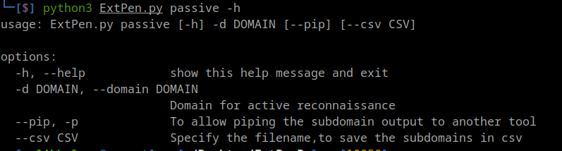
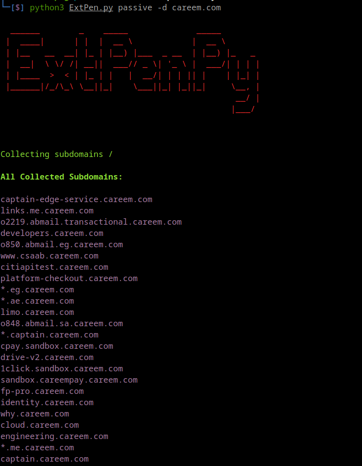
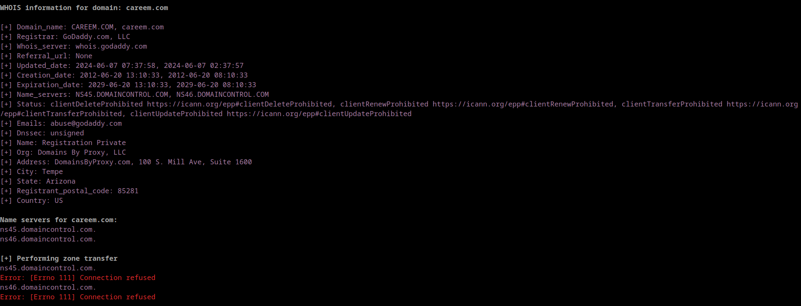
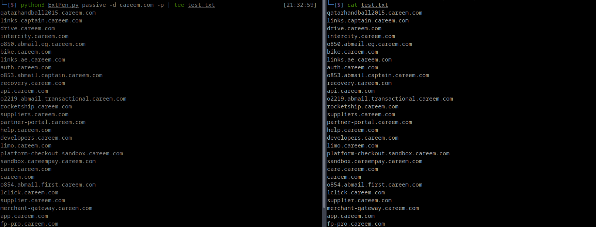
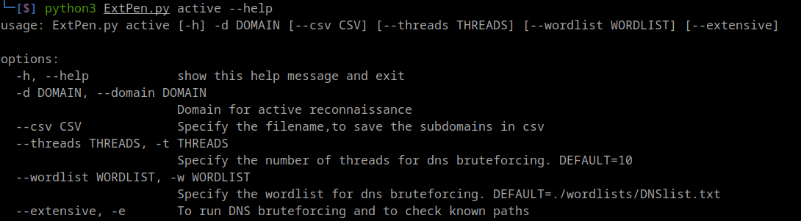
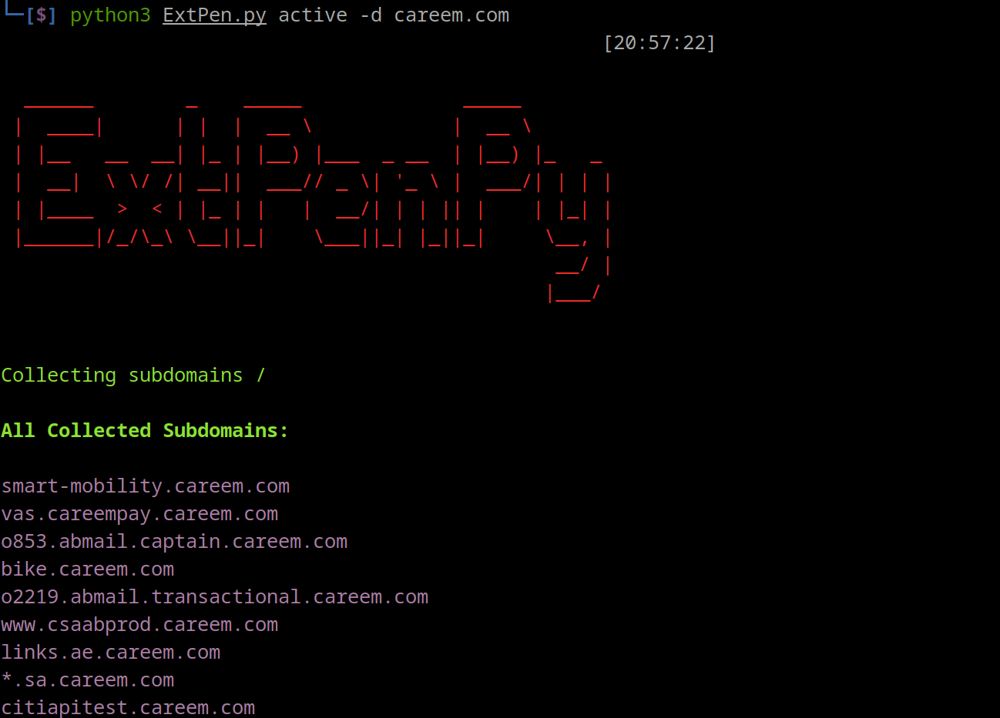
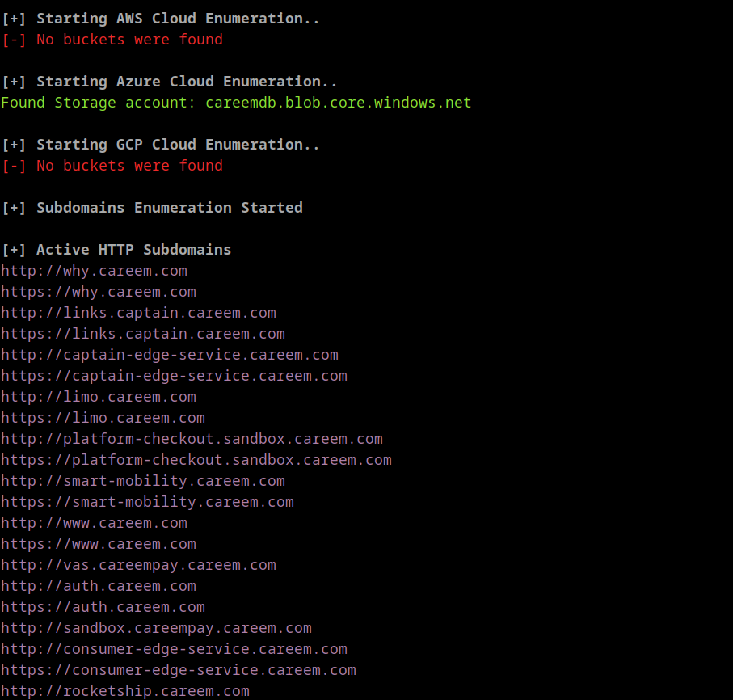
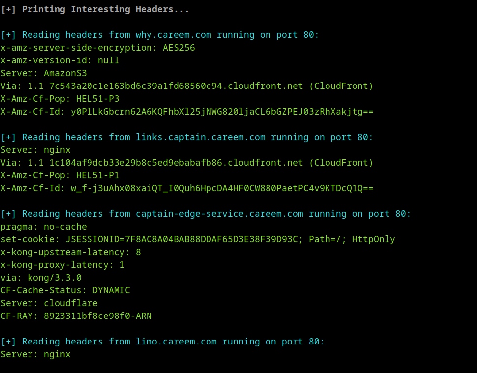
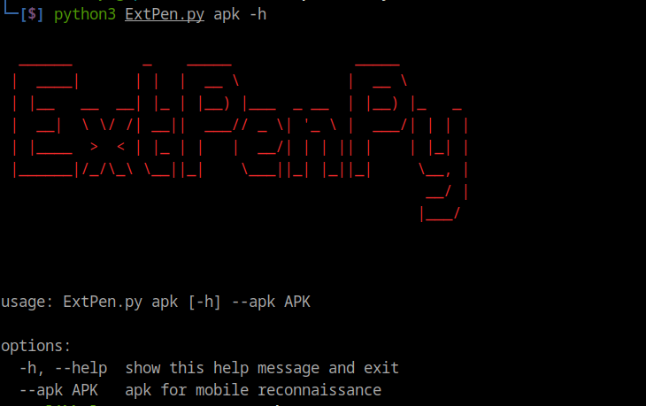
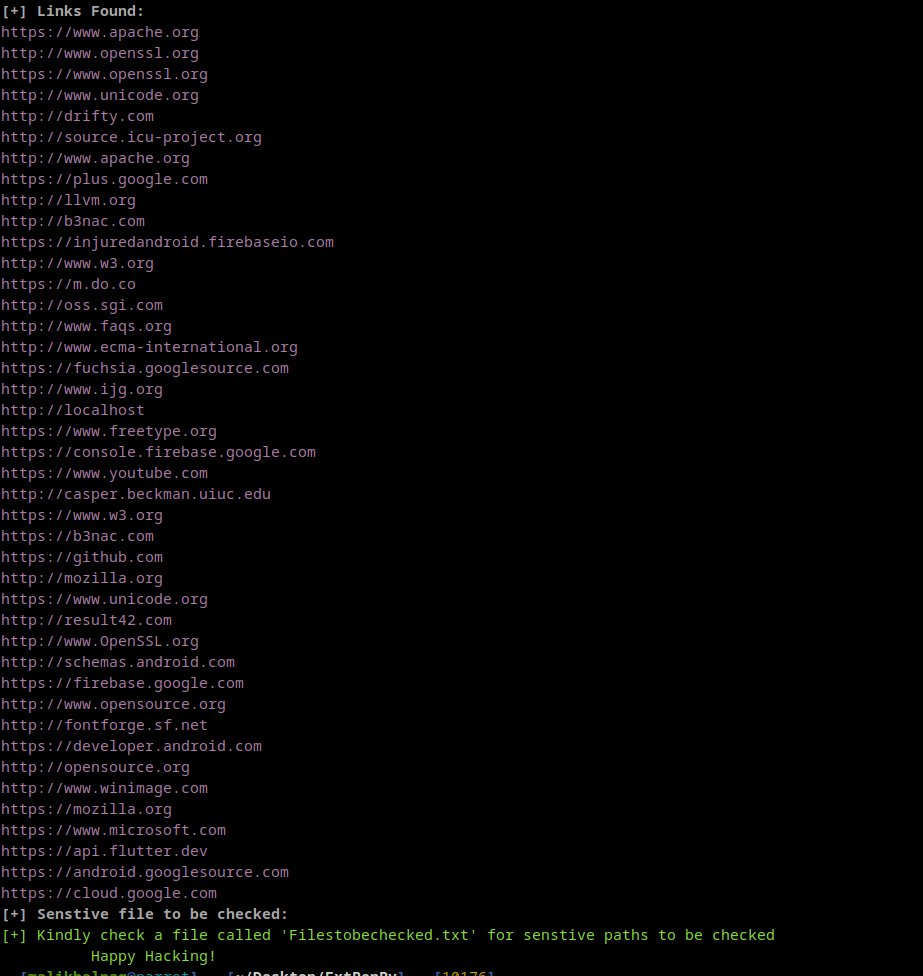

## ExtPenPy is a tool that will help you finalizing your recon phase faster.

<p align="center">
  
</p>


### ExtPenPy consists of three modes:

1. **Passive**:
    - Collecting Subdomains (without brute forcing)
    - Whois database check
    - Zone Transfer
    - DNS records check
    - Reverse DNS Lookup
    - IP addresses range
    - Regex to Google Dork
2. **Active:** 
    - Cloud storage enumeration
    - Identifying known paths (.git, .htaccess, etc)
    - Intersting Headers
    - Taking screenshots of validated subdomains
    - All the passive stuff
    - Validating hosts running HTTP[S] 
    - Gathering included paths (without bruteforcing)
    - Collecting subdomains (with brute forcing)
3. **APK:**
    - Collecting URL"s
    - Root Detection Check
    - SDK Version Check
    - Decompiling APK to smali and java
    - Extracting Sensitive information like API keys, passwords, etc..
    - Debuggable mode Check
    - Checking permissions
    - Checking activities and (Exported Activities)
    - Check if  backup is allowed
    - collecting strings.xml files
      
### Sample Run
https://github.com/maliktawfiq/ExtPenPy/assets/45318602/e41a9c6f-3918-4fe7-89c9-022741bc57e9

### Chrome Installation (Must be installed for screenshots module to work)
#### Windows
<a href="https://www.google.com/chrome/next-steps.html?installdataindex=empty&statcb=1&defaultbrowser=0#">Install chrome for windows</a>

  
#### linux
```bash
wget https://dl.google.com/linux/direct/google-chrome-stable_current_amd64.deb
sudo dpkg -i ./google-chrome-stable_current_amd64.deb
```

### Installation:

```bash
git clone https://github.com/maliktawfiq/ExtPenPy.git
cd ExtPenPy
pip install -r requierments.txt
sudo apt install apktool
python3 ExtPen.py -h
```

### Docker:

```bash
git clone https://github.com/maliktawfiq/ExtPenPy.git
cd ExtPenPy
docker build -t extpenpy .
#linux
docker run -it -v $PWD:/app extpenpy -h
#windows
docker run -it -v "%cd%":/app extpenpy -h
```

### Usage:

- ### **Passive**

```bash
python3 ExtPenPy -h
```



```bash
python3 ExtPenPy passive -d careem.com
```




- Whois databse and zone trasfer attempt



- -p or —pip allows piping the subdomain output to a file, tool..etc as shown below

```bash
python3 ExtPen.py passive -d $Domain -p | tee test.txt
```


- you can add —csv to save the subdomains in csv file.

```bash
python3 passive -d $domain --csv ./subdomains
```

- ### **Active:**

```bash
python3 ExtPen.py active --help
```


```bash
python3 ExtPen.py active -d $domain
```



- Example of cloud storage enumeration



- Example of web enumeration



- ### **APK (currently only for linux):**
After running the APK analysis two directories will be created. 

1. Javacode: which will contain the decompiled code
2. apk_decomiled: which holds the data before decompiling

```bash
python3 ExtPen.py apk -h
```


- The activities and the permissions the applications uses


- Certificate check and identifying sensitive strings found


- Exporting links found in the APK




- ### **Disclaimer**
**ExtPenPy was made to help security researchers speed up the reconnaissance phase, it is intended for legal and ethical penetration testing only. Unauthorized use is prohibited and may be illegal. Users must ensure compliance with all relevant laws and regulations. The developers are not liable for any misuse or damages.**
