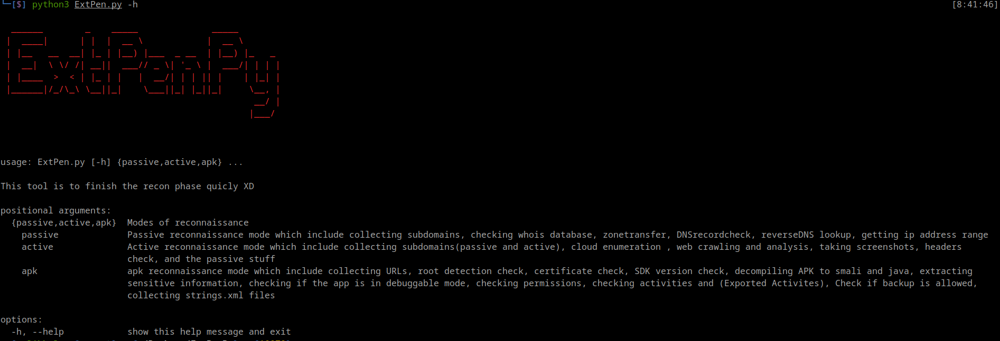

## ExtPenPy is A tool that will help you finishing your recon phase faster.

### Objectives:

### In three modes:

1. **Passive**:
    - Collecting Subdomains (without brute forcing)
    - Whois database check
    - Zone Transfer
    - DNS records check
    - Reverse DNS Lookup
    - IP addresses range
    - Regex to Google Dork
2. **Active:** 
    - Collecting  subdomains (with brute forcing)
    - All the passive stuff
    - Cloud enumeration
        - **TODO**:
            - Web Crawling
            - Headers check
            - Taking screenshots
3. **APK:**
    - Collecting URL’s
    - Root Detection Check
    - SDK Version Check
    - Decompiling APK to smali and java
    - Extracting Sensitive information like API keys, passwords, etc..
    - Debuggable mode Check
    - Checking permissions
    - Checking activities and (Exported Activities)
    - Check if  backup is allowed
    - collecting strings.xml files

### Installation:

```bash
git clone https://github.com/maliktawfiq/ExtPenPy.git
cd ExtPenPy
pip install -r requierments.txt
sudo apt install apktool
python3 ExtPen.py -h
```

### Docker:

```bash
git clone https://github.com/maliktawfiq/ExtPenPy.git
cd ExtPenPy
docker build -t extpenpy .
docker run -it -v $PWD:/app extpenpy -h
```

### how to use:

- **Passive**

```bash
python3 ExtPenPy -h
```



```bash
python3 ExtPenPy passive -d uber.com
```


- -p or —pip allows piping the subdomain output to a file, tool..etc as shown below

```bash
python3 ExtPen.py passive -d <domain> -p | httpx -sc -fr -silent
```


**you can add —csv to save the subdomains in csv file.**

```bash
python3 passive -d uber.com --csv ./subdomains
```


- **Active:**

```bash
Docker:
docker run -it -v $PWD:/app extpenpy active -h
CMD:
python3 ExtPen.py active -h
python3 ExtPen.py active -d uber.com -w ./custemlist
```


- **APK:**

```bash
Docker:
docker run -it -v $PWD:/app extpenpy apk -h
CMD:
python3 ExtPen.py apk -h
```


After running the APK analysis two directories will be created. 

1. Javacode: which will contain the decompiled code
2. apk_decomiled: which holds the data before decompiling


